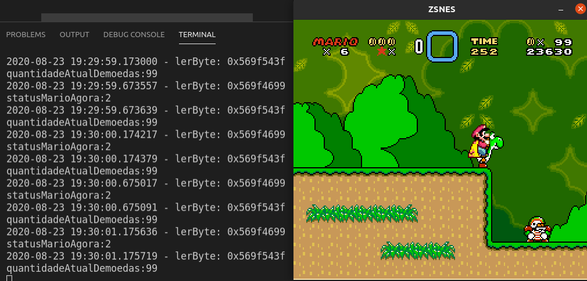
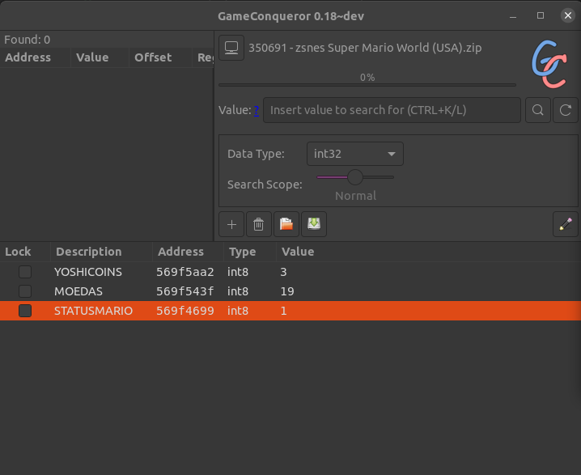

# Deps

    pip3 install -r requirements.txt

# Run

    python3 main.py

# Tested on Linux

Ubuntu 2020.04

* zsnes 1.51
* scanmen/gameconqueror

Enabling processes debug

    echo 0 | sudo tee /proc/sys/kernel/yama/ptrace_scope

Disable ASLR

    echo 0 | sudo tee /proc/sys/kernel/randomize_va_space

# Ref

[ptrace-processes-kernel](https://linux-audit.com/protect-ptrace-processes-kernel-yama-ptrace_scope)

[linux-aslr](https://linux-audit.com/linux-aslr-and-kernelrandomize_va_space-setting)

[memdig](https://github.com/skeeto/memdig)

[frida-doom](https://sensepost.com/blog/2019/hacking-doom-for-fun-health-and-ammo)